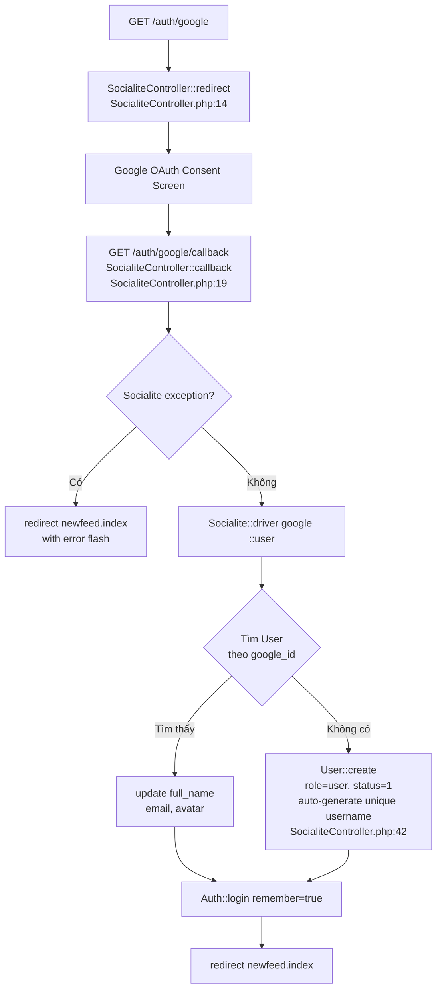
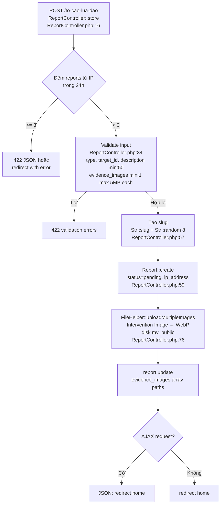
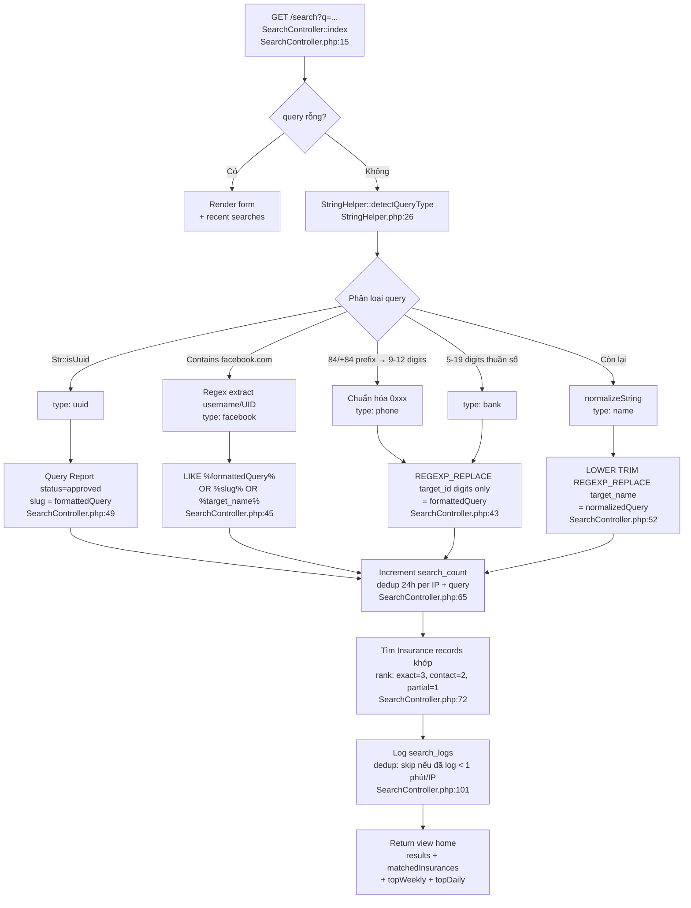
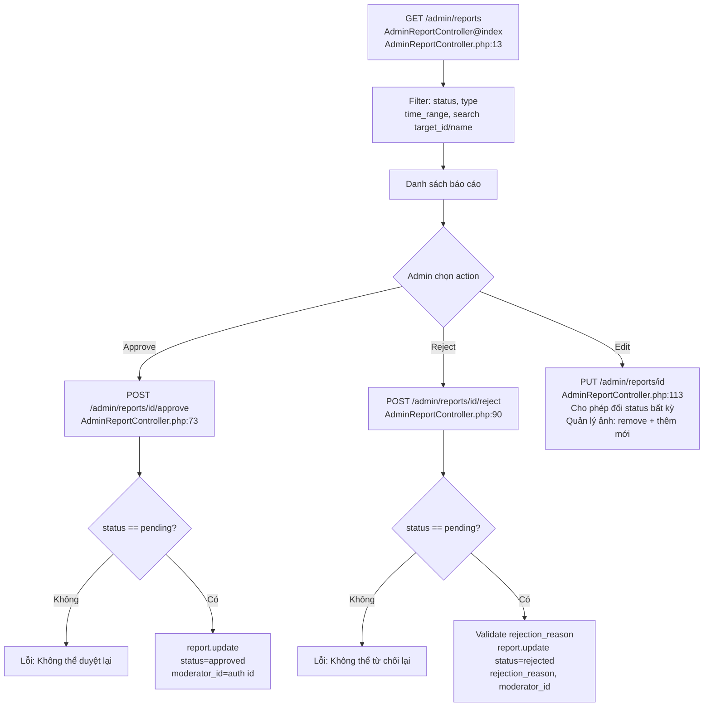
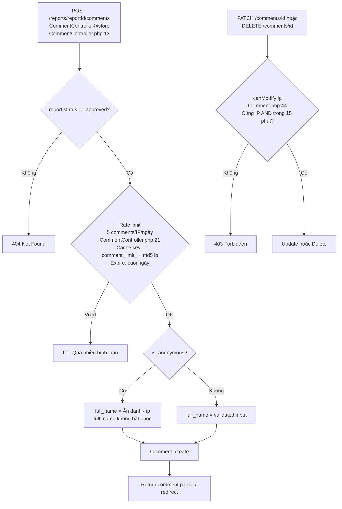
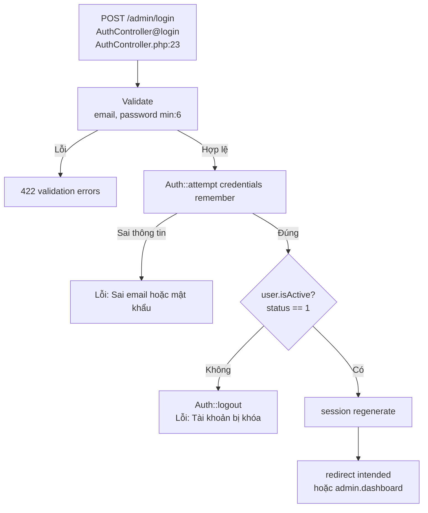

# MST-CheckScam — Tài Liệu Hệ Thống Toàn Diện

> **Cập nhật lần cuối:** 2026-07-04
> **Nguồn:** Phân tích trực tiếp từ mã nguồn thực tế (không phải tài liệu cũ)
> **So sánh với spec:** README.md (business logic dự định)

---

## Mục Lục

1. [Tổng quan dự án](#1-tổng-quan-dự-án)
2. [Tech Stack](#2-tech-stack)
3. [Kiến trúc thư mục](#3-kiến-trúc-thư-mục)
4. [Routing & Entry Points](#4-routing--entry-points)
5. [Database — Schema toàn bộ](#5-database--schema-toàn-bộ)
6. [ERD — Sơ đồ quan hệ thực thể](#6-erd--sơ-đồ-quan-hệ-thực-thể)
7. [Business Logic — Luồng nghiệp vụ cốt lõi](#7-business-logic--luồng-nghiệp-vụ-cốt-lõi)
8. [Danh sách tính năng theo mức hoàn thiện](#8-danh-sách-tính-năng-theo-mức-hoàn-thiện)
9. [Middleware & Bảo mật](#9-middleware--bảo-mật)
10. [Helpers & Services nội tại](#10-helpers--services-nội-tại)
11. [Convention & Lưu ý cho dev mới](#11-convention--lưu-ý-cho-dev-mới)
12. [Cài đặt & Triển khai](#12-cài-đặt--triển-khai)

---

## 1. Tổng quan dự án

MST-CheckScam là web tra cứu lừa đảo cộng đồng dành cho thị trường Việt Nam. Người dùng có thể tìm kiếm STK ngân hàng, SĐT, tài khoản Facebook để kiểm tra xem đối tượng đó có bị tố cáo lừa đảo không.

| Module | Mô tả |
|---|---|
| **Tra cứu (Search)** | Tìm kiếm theo STK, SĐT, Facebook URL/UID, tên |
| **Tố cáo (Report)** | Form gửi báo cáo kèm ảnh bằng chứng, không cần tài khoản |
| **Bình luận (Comment)** | Bình luận vào từng bài tố cáo, có chế độ ẩn danh |
| **Quỹ bảo hiểm (Insurance)** | Badge uy tín hiển thị kèm kết quả tìm kiếm |
| **Bài viết (Post)** | Blog/tin tức do admin tạo |
| **Khu Mua Bán (Newfeed)** | Marketplace dạng Facebook Group, đăng tin cần Google OAuth |
| **Banner quảng cáo** | Cho thuê vị trí banner theo thời hạn |
| **Admin Panel** | Duyệt tố cáo, CRUD toàn bộ nội dung |

**Đặc điểm kỹ thuật nổi bật:**
- Web app Laravel thuần (không SPA), Blade templates toàn bộ
- Khu Mua Bán (Newfeed) dùng JSON API + plain JS (AJAX)
- Hỗ trợ 2 loại người dùng trên cùng 1 guard: admin/moderator (email+password) + public user (Google OAuth)
- Config động lưu trong DB (bảng `settings`), cache 1 giờ
- Ảnh upload tự động chuyển sang WebP qua Intervention Image

---

## 2. Tech Stack

### Backend

| Package | Version | Vai trò |
|---|---|---|
| PHP | ^8.2 | Runtime |
| Laravel Framework | ^12.0 | Core framework |
| Laravel Socialite | * | Google OAuth |
| Laravel Tinker | ^2.10.1 | REPL/debug |
| artesaos/seotools | * | SEO meta tags, OpenGraph, JSON-LD |
| intervention/image-laravel | * | Resize + convert ảnh sang WebP |
| spatie/laravel-medialibrary | * | Media file management (polymorphic) |
| spatie/laravel-permission | * | ⚠️ Cài nhưng KHÔNG DÙNG — phân quyền dùng users.role thủ công |
| spatie/laravel-sitemap | * | Sitemap generator |

**Nguồn:** composer.json:11-22

### Dev dependencies

| Package | Version | Vai trò |
|---|---|---|
| laravel/pint | ^1.24 | PHP code formatter |
| pestphp/pest | ^3.8 | Test framework |
| pestphp/pest-plugin-laravel | ^3.2 | Pest + Laravel integration |
| laravel/boost | 2.0 | MCP dev tooling |
| laravel/pail | ^1.2.2 | Log tailing |
| laravel/sail | ^1.41 | Docker dev environment |

**Nguồn:** composer.json:23-32

### Frontend

| Package | Version | Vai trò |
|---|---|---|
| Vite | ^7.0.7 | Bundler |
| laravel-vite-plugin | ^2.0.0 | Tích hợp Vite |
| Tailwind CSS | ^4.2.1 | CSS framework |
| axios | ^1.11.0 | HTTP client (AJAX trong Newfeed) |
| prettier + prettier-plugin-blade | ^3.8.1 / ^2.1.21 | Blade formatter |
| husky + lint-staged | ^9.1.7 / ^16.3.2 | Pre-commit hooks |
| @commitlint/cli | ^20.4.3 | Conventional commits |

**Nguồn:** package.json

### Môi trường

- Queue driver: database (default, .env.example), có thể đổi sang redis
- Cache store: database (default)
- Session: database

---

## 3. Kiến trúc thư mục

```
mst-checkscam/
├── app/
│   ├── Console/Commands/          # Rỗng — không có custom Artisan command
│   ├── Helpers/
│   │   ├── StringHelper.php       # ⭐ Quan trọng nhất: normalize query, mask PII, slug
│   │   ├── ConfigHelper.php       # DB-backed config với cache 1h
│   │   ├── CommentHelper.php      # Rate limit cache key cho comment
│   │   ├── FileHelper.php         # Upload ảnh + chuyển WebP, disk 'my_public'
│   │   ├── StatsHelper.php        # Top weekly reports, top daily searches
│   │   └── Helpers.php            # formatCurrency()
│   ├── Http/
│   │   ├── Controllers/           # Public-facing (flat namespace)
│   │   │   └── Admin/             # Admin panel (Admin\ namespace)
│   │   ├── Middleware/
│   │   │   ├── Authenticate.php   # Custom redirect: admin → admin login
│   │   │   └── CheckMaintenanceMode.php  # DB-backed maintenance mode
│   │   └── (không có Requests/)  # Không dùng Form Request classes
│   ├── Mail/
│   │   └── PostHiddenMail.php     # Email khi bài Newfeed bị ẩn
│   ├── Models/                    # 10 Eloquent models
│   ├── Policies/
│   │   └── NewfeedPostPolicy.php  # delete: owner hoặc admin
│   └── Providers/
│       └── AppServiceProvider.php # (standard)
├── bootstrap/
│   └── app.php                    # Đăng ký middleware global + alias
├── config/                        # Laravel config files (standard)
├── database/
│   ├── migrations/                # 16 migration files
│   ├── factories/                 # Có nhưng rỗng
│   └── seeders/                   # Có nhưng rỗng
├── docs/                          # Tài liệu dự án (file này)
├── public/
│   ├── assets/                    # Static assets cũ (img, css, js, plugins)
│   └── uploads/                   # Ảnh upload báo cáo (disk 'my_public')
├── resources/
│   ├── css/app.css                # Entry point CSS (Tailwind v4)
│   ├── js/app.js                  # Entry point JS (chỉ 8 dòng: dark mode toggle)
│   └── views/
│       ├── home.blade.php         # Trang chủ + search results (dùng chung)
│       ├── maintenance.blade.php  # Trang bảo trì
│       ├── admin/                 # Admin panel views
│       ├── components/            # Blade components (ads, hero, breadcrumb)
│       ├── insurances/            # Trang bảo hiểm public
│       ├── layouts/               # app.blade.php (public), admin/layouts/
│       ├── legal/                 # terms, dispute
│       ├── mail/                  # Email templates
│       ├── newfeed/               # Khu mua bán views
│       ├── partials/              # comment-items.blade.php (AJAX partial)
│       ├── posts/                 # Blog views
│       ├── reports/               # Form tố cáo
│       ├── scammer/               # Trang chi tiết scammer (/{slug})
│       ├── support/               # guide, contact
│       └── system/                # api, partners pages
├── routes/
│   ├── web.php                    # Toàn bộ routes: public + /admin (1 file duy nhất)
│   └── console.php                # Scheduled commands (rỗng)
└── tests/
    ├── Feature/                   # Có thư mục, không có test file
    └── Unit/                      # Có thư mục, không có test file
```

---

## 4. Routing & Entry Points

**Toàn bộ routes trong 1 file:** routes/web.php

### 4.1 Public routes

| URL | Controller | Tên route | Ghi chú |
|---|---|---|---|
| GET / | HomeController@index | home | Trang chủ + latest reports |
| GET /to-cao-lua-dao | (closure) | reports | Form tố cáo |
| POST /to-cao-lua-dao | ReportController@store | report.store | Gửi tố cáo |
| GET /bao-hiem-cs | InsuranceController@index | insurances.frontend.index | Danh sách bảo hiểm |
| GET /bao-hiem-cs/{slug} | InsuranceController@show | insurances.frontend.show | Chi tiết bảo hiểm |
| GET /bai-viet | PostController@index | posts.frontend.index | Danh sách bài viết |
| GET /bai-viet/{slug} | PostController@show | posts.frontend.show | Chi tiết bài viết |
| GET /newfeed | NewfeedController@index | newfeed.index | Khu mua bán |
| GET /newfeed/{post} | NewfeedController@show | newfeed.show | Chi tiết bài đăng |
| GET /api/newfeed/posts | NewfeedPostController@index | api.newfeed.posts.index | JSON API: load posts |
| POST /api/newfeed/posts | NewfeedPostController@store | api.newfeed.posts.store | JSON API: tạo bài |
| DELETE /api/newfeed/posts/{post} | NewfeedPostController@destroy | api.newfeed.posts.destroy | JSON API: xoá bài |
| POST /api/newfeed/posts/{post}/report | NewfeedPostReportController@store | api.newfeed.posts.report | JSON API: report bài |
| GET /auth/google | SocialiteController@redirect | auth.google | OAuth redirect |
| GET /auth/google/callback | SocialiteController@callback | auth.google.callback | OAuth callback |
| POST /auth/logout | SocialiteController@logout | auth.logout | Logout public user |
| GET /search | SearchController@index | search.index | Search results |
| GET /search/autocomplete | SearchController@autoComplete | search.autocomplete | Autocomplete JSON |
| POST /search/clear-history | SearchController@clearHistory | search.clearHistory | Xóa lịch sử |
| POST /reports/{reportId}/comments | CommentController@store | comment.store | Gửi comment |
| PATCH /comments/{id} | CommentController@update | comment.update | Sửa comment |
| DELETE /comments/{id} | CommentController@destroy | comment.destroy | Xóa comment |
| GET /generate-sitemap | SitemapController@generate | sitemap.generate | Tạo sitemap |
| **GET /{slug}** | **ReportController@show** | **scammer.show** | **CATCH-ALL — cuối file** |

> ⚠️ **Nguy hiểm catch-all:** `GET /{slug}` là route CUỐI CÙNG (routes/web.php:186). Bất kỳ route mới nào thêm phía dưới nó sẽ bị shadow. Luôn thêm route TRƯỚC dòng này.

### 4.2 Admin routes (/admin/*, middleware: auth)

| URL | Controller | Mô tả |
|---|---|---|
| GET /admin/ | DashboardController@index | Dashboard + metrics |
| GET/POST /admin/reports/* | AdminReportController | CRUD + approve/reject |
| GET/POST /admin/insurances/* | AdminInsuranceController | CRUD bảo hiểm |
| GET/POST /admin/posts/* | AdminPostController | CRUD bài viết |
| GET /admin/comments + DELETE /{id} | AdminCommentController | Xem + xóa comment |
| GET/POST /admin/users/* | AdminUserController | CRUD users |
| PATCH /admin/users/{user}/verify | AdminUserController@toggleVerify | Bật/tắt badge |
| GET/POST /admin/banners/* | AdminBannerController | CRUD banners |
| POST /admin/banners/{id}/toggle | AdminBannerController@toggleStatus | Bật/tắt banner |
| GET/POST /admin/settings | AdminSettingController | Cài đặt hệ thống |
| GET /admin/search-analytics | AdminSearchAnalyticsController@index | Phân tích tìm kiếm |
| GET /admin/newfeed/hidden | AdminNewfeedController@hidden | Bài Newfeed bị ẩn |
| PATCH /admin/newfeed/posts/{post}/unhide | AdminNewfeedController@unhide | Bỏ ẩn bài |
| GET/POST /admin/login | AuthController | Đăng nhập admin |
| GET /admin/logout | AuthController@logout | Đăng xuất |

**Nguồn:** routes/web.php:78-186

---

## 5. Database — Schema toàn bộ

Tổng cộng **16 migration files**, tạo ra **16+ tables** (3 standard Laravel tables từ 1 migration).

### 5.1 Nhóm Core System

#### `users` — cả admin/moderator lẫn public user

| Cột | Kiểu | Ghi chú |
|---|---|---|
| id | bigint PK | |
| username | varchar UNIQUE | |
| email | varchar UNIQUE | |
| email_verified_at | timestamp nullable | |
| password | varchar nullable | NULL cho tài khoản Google OAuth |
| avatar | varchar nullable | URL ảnh |
| full_name | varchar nullable | |
| role | varchar | 'admin', 'moderator', 'user' — xem lưu ý bên dưới |
| status | tinyint | 1: Active, 0: Inactive |
| google_id | varchar nullable UNIQUE | Thêm bởi migration 2026_06_08 |
| is_verified | tinyint | Badge xác minh — thêm bởi migration 2026_06_08 |
| remember_token | varchar nullable | |

> ⚠️ **Lưu ý role:** Migration default('moderator'). SocialiteController tạo user với role='user'. Thực tế có 3 giá trị. CLAUDE.md chỉ đề cập admin/moderator.

**Nguồn:** database/migrations/0001_01_01_000000_create_users_table.php, 2026_06_08_000001_add_google_auth_and_verified_to_users_table.php

#### `password_reset_tokens`, `sessions`, `cache`, `jobs` — Standard Laravel tables

#### `settings` — Key-value config (name là PK)

**Nguồn:** database/migrations/2026_03_08_152358_create_settings_table.php

---

### 5.2 Nhóm Core Business

#### `reports` — ⭐ Model trung tâm

| Cột | Kiểu | Ghi chú |
|---|---|---|
| id | bigint PK | |
| type | enum(account, website) | Loại tố cáo |
| reporter_name | varchar | Tên người gửi |
| reporter_contact | varchar | SĐT/Zalo liên hệ |
| target_id | varchar INDEX | STK / SĐT / URL / UID Facebook |
| ip_address | varchar(45) nullable | IP khi gửi |
| target_name | varchar nullable | Tên đối tượng |
| target_bank | varchar nullable | Tên ngân hàng |
| damage_amount | decimal(10,2) nullable | Số tiền thiệt hại |
| category | varchar nullable INDEX | Hình thức lừa đảo |
| description | text | Mô tả (min 50 ký tự) |
| evidence_images | json nullable | Mảng đường dẫn ảnh |
| status | varchar INDEX | pending, approved, rejected |
| rejection_reason | varchar nullable | |
| view_count | int unsigned | Đếm lượt xem (dedup 24h/IP) |
| search_count | int unsigned | Đếm lượt search ra (dedup 24h/IP) |
| moderator_id | FK → users nullable | Admin đã duyệt/từ chối |
| slug | varchar UNIQUE nullable | URL-friendly ID |

**Nguồn:** database/migrations/2026_03_08_152399_create_reports_table.php

#### `comments` — Bình luận vào báo cáo

| Cột | Kiểu | Ghi chú |
|---|---|---|
| id | bigint PK | |
| report_id | FK → reports CASCADE | |
| full_name | varchar | "Ẩn danh - {ip}" nếu ẩn danh |
| content | text | 10–1000 ký tự |
| ip_address | varchar(45) | Dùng để kiểm soát edit/delete 15 phút |
| is_anonymous | boolean | |

**Nguồn:** database/migrations/2026_03_08_152400_create_comments_table.php

---

### 5.3 Nhóm Nội dung

#### `insurances` — Quỹ bảo hiểm/badge uy tín

| Cột | Kiểu | Ghi chú |
|---|---|---|
| id | bigint PK | |
| full_name | varchar | |
| avatar | varchar nullable | |
| amount | decimal(15,2) | Số tiền đóng quỹ |
| insurance_date | date | Ngày đăng ký |
| expired_at | date nullable | NULL = không hết hạn |
| contact_info | json nullable | Mảng thông tin liên hệ |
| payment_accounts | json nullable | Mảng STK/SĐT |
| services | json nullable | Mảng dịch vụ cung cấp |
| status | tinyint | 1: Active, 0: Inactive |
| slug | varchar UNIQUE INDEX | Dùng chung namespace với posts |

**Nguồn:** database/migrations/2026_03_08_152401_create_insurances_table.php

#### `posts` — Blog/bài viết

| Cột | Kiểu | Ghi chú |
|---|---|---|
| id | bigint PK | |
| title | varchar | |
| slug | varchar UNIQUE INDEX | Dùng chung namespace với insurances |
| description | varchar nullable | Meta description |
| content | longText | |
| thumbnail | varchar nullable | |
| is_featured | tinyint | |
| view_count | int unsigned | |
| hashtags | varchar nullable | |
| author_id | FK → users nullable SET NULL | |

**Nguồn:** database/migrations/2026_03_08_152401_create_posts_table.php

#### `banners` — Quảng cáo banner

| Cột | Kiểu | Ghi chú |
|---|---|---|
| position | enum(home_top, home_sidebar, home_between, scammer, blog) | |
| type | enum(horizontal, square) | |
| start_date / end_date | date nullable | NULL = không giới hạn ngày |
| status | boolean | |
| sort_order | int | |

**Nguồn:** database/migrations/2026_03_17_000001_create_banners_table.php

---

### 5.4 Nhóm Hỗ trợ

#### `search_logs` — Log tìm kiếm (append-only)

| Cột | Kiểu |
|---|---|
| search_query | varchar INDEX |
| is_found | tinyint INDEX |
| ip_address | varchar(45) nullable |

#### `banks` — Danh sách tên ngân hàng (reference)

| Cột | Kiểu |
|---|---|
| name | varchar UNIQUE INDEX |
| logo | varchar nullable |

#### `media` — Spatie MediaLibrary (polymorphic)

Bảng polymorphic cho Report, Post, Insurance, Banner, User. Conversions: thumb, optimized.

---

### 5.5 Nhóm Khu Mua Bán (Newfeed)

#### `newfeed_posts`

| Cột | Kiểu | Ghi chú |
|---|---|---|
| id | bigint PK | |
| user_id | FK → users CASCADE | Yêu cầu Google OAuth |
| category | varchar(100) INDEX | |
| content | text | |
| price | decimal(15,0) nullable | |
| image_path | varchar(500) nullable | Cột cũ (deprecated) |
| image_paths | json nullable | Thêm bởi migration 2026_06_09 — mảng ảnh |
| is_hidden | tinyint INDEX | 0: hiện, 1: ẩn |
| hidden_by_admin | tinyint | Dành riêng cho admin ẩn thủ công |
| report_count | int unsigned | Số lượt bị report |
| deleted_at | timestamp nullable | SoftDeletes |

> ⚠️ Có 2 cột ảnh: image_path (cũ, single) và image_paths (mới, array JSON). Code ưu tiên image_paths. Dữ liệu cũ có thể chỉ có image_path.

#### `newfeed_post_reports`

| Cột | Kiểu | Ghi chú |
|---|---|---|
| id | bigint PK | |
| post_id | FK → newfeed_posts CASCADE | |
| reporter_id | FK → users CASCADE | |
| reason | varchar(255) nullable | |
| created_at | timestamp useCurrent | Không có updated_at |
| UNIQUE(post_id, reporter_id) | | Mỗi user chỉ report 1 lần/bài |

---

## 6. ERD — Sơ đồ quan hệ thực thể

```
users
 ├── moderator_id ──< reports ──< comments
 ├── author_id ──< posts
 └── user_id ──< newfeed_posts ──< newfeed_post_reports ><── users (reporter_id)

insurances  (standalone, slug namespace shared với posts)
posts       (standalone, slug namespace shared với insurances)
banners     (standalone)
banks       (reference, standalone)
settings    (key-value, standalone)
search_logs (append-only log)

media (polymorphic → Report, Post, Insurance, Banner, User)
```

### Foreign keys tóm tắt

| Bảng | Cột FK | Tham chiếu | Hành vi |
|---|---|---|---|
| reports | moderator_id | users.id | SET NULL on delete |
| comments | report_id | reports.id | CASCADE delete |
| posts | author_id | users.id | SET NULL on delete |
| newfeed_posts | user_id | users.id | CASCADE delete |
| newfeed_post_reports | post_id | newfeed_posts.id | CASCADE delete |
| newfeed_post_reports | reporter_id | users.id | CASCADE delete |

---

## 7. Business Logic — Luồng nghiệp vụ cốt lõi

### 7.1 Google OAuth (đăng ký/đăng nhập public user)



---

### 7.2 Gửi tố cáo

> ⚠️ `slug` tạo bằng `Str::slug + Str::random(8)` — không đảm bảo unique, trùng sẽ throw DB error (`ReportController.php:57`).



---

### 7.3 Tìm kiếm (Search)

> `home.blade.php` dùng chung cho cả trang chủ (`HomeController`) lẫn kết quả search (`SearchController`). `REGEXP_REPLACE` yêu cầu **MySQL 8+**.



---

### 7.4 Duyệt tố cáo (Admin)

> **Không có:** email notification cho người gửi sau khi duyệt/từ chối.



---

### 7.5 Newfeed (Khu Mua Bán)

> ⚠️ `POST_REPORT_THRESHOLD` đọc từ `env()` trực tiếp (`NewfeedPostReportController.php:47`) — admin không thể thay đổi runtime.
> ⚠️ Newfeed upload dùng `Storage::disk('public')` — khác với báo cáo dùng disk `'my_public'`.

```mermaid
flowchart TD
    subgraph Đăng bài
        A[POST /api/newfeed/posts\nNewfeedPostController.php:59] --> B{Auth::check?}
        B -->|Không| ERR1[401 Unauthorized]
        B -->|Có| C[Validate: content min:10 max:5000\nprice, category, images max:10 each 5MB]
        C --> D[Upload ảnh\nStorage::disk public\nstorage/posts/]
        D --> E[NewfeedPost::create\nuser_id, image_paths array]
        E --> F[201 JSON]
    end

    subgraph Report bài → Auto-hide
        G[POST /api/newfeed/posts/post/report\nNewfeedPostReportController.php:15] --> H{Auth::check?}
        H -->|Không| ERR2[401]
        H -->|Có| I{post.user_id == Auth::id?}
        I -->|Có| ERR3[403: Không tự report]
        I -->|Không| J{Đã report bài này chưa?\nunique post_id + reporter_id}
        J -->|Rồi| ERR4[422: Duplicate]
        J -->|Chưa| K[NewfeedPostReport::create]
        K --> L[post.increment report_count]
        L --> M{report_count >= POST_REPORT_THRESHOLD\nAND NOT is_hidden?}
        M -->|Có| N[post.update is_hidden=1\nMail::queue PostHiddenMail\nNewfeedPostReportController.php:53]
        M -->|Không| O[Done]
    end

    subgraph Admin Unhide
        P[GET /admin/newfeed/hidden\nAdminNewfeedController.php:12] --> Q[Danh sách bài bị ẩn]
        Q --> R[PATCH /admin/newfeed/posts/post/unhide]
        R --> S[post.update is_hidden=0]
    end
```

---

### 7.6 Comment



---

### 7.7 Admin login

> **Không có:** 2FA, IP whitelist, brute-force throttle (`AuthController.php`).



---

## 8. Danh sách tính năng theo mức hoàn thiện

| Tính năng | Trạng thái | Ghi chú | File chính |
|---|---|---|---|
| Trang chủ + search form | ✅ Done | | HomeController.php |
| Search + normalization | ✅ Done | Phone/bank/facebook/uuid/name | StringHelper.php, SearchController.php |
| Autocomplete search | ✅ Done | JSON, min 2 ký tự, max 8 gợi ý | SearchController.php:169 |
| Gửi tố cáo (anonymous) | ✅ Done | Không cần tài khoản, rate limit 3/IP/24h | ReportController.php |
| Chi tiết báo cáo /{slug} | ✅ Done | SEO đầy đủ (OG, JSON-LD), view dedup | ReportController.php:88 |
| Comment (ẩn danh, rate limit) | ✅ Done | 5/IP/ngày, edit/delete 15 phút | CommentController.php |
| Quỹ bảo hiểm / badge uy tín | ✅ Done | Admin tạo thủ công, hiện khi search | Insurance.php |
| Blog/bài viết | ✅ Done | Admin tạo, view public | Post.php, AdminPostController.php |
| Banner quảng cáo | ✅ Done | 5 vị trí, time-window | Banner.php, AdminBannerController.php |
| Admin panel (duyệt, CRUD) | ✅ Done | Reports, comments, users, settings, banners, posts, insurances | Admin/ |
| Search analytics (admin) | ✅ Done | Weekly chart, top searches | AdminSearchAnalyticsController.php |
| Google OAuth (public user) | ✅ Done | Chỉ dùng cho Newfeed | SocialiteController.php |
| Khu Mua Bán (Newfeed) | ✅ Done | Đăng, filter, report, auto-hide | NewfeedPostController.php |
| Newfeed admin (unhide) | ✅ Done | Xem + bỏ ẩn bài | AdminNewfeedController.php |
| Maintenance mode | ✅ Done | DB config, all non-admin routes | CheckMaintenanceMode.php |
| Sitemap generator | ✅ Done | Gọi thủ công qua /generate-sitemap | SitemapController.php |
| SEO tools | ✅ Done | artesaos/seotools, đầy đủ trên report detail | ReportController.php:134+ |
| Image upload → WebP | ✅ Done | Intervention Image, fallback | FileHelper.php |
| **Telegram Bot** | ❌ Không implement | Mô tả trong README nhưng không có code | — |
| **Public API (bán API)** | ❌ Không implement | Chỉ có static view /api-checkscam | routes/web.php:54 |
| **Test suite** | ❌ Không có | Thư mục tests/ rỗng | tests/ |
| **Admin 2FA** | ❌ Không implement | Không có code xử lý 2FA | — |
| **Rate limiting admin login** | ❌ Không có | Không có throttle cho /admin/login | — |

---

## 9. Middleware & Bảo mật

### Global web middleware

```
bootstrap/app.php:15 → $middleware->append(CheckMaintenanceMode::class)
```

| Middleware | Áp dụng | Mô tả |
|---|---|---|
| Laravel built-ins | Tất cả | CSRF, session, cookies |
| CheckMaintenanceMode | Tất cả web, trừ /admin/* | Đọc maintenance_mode từ DB/cache |

**Nguồn:** bootstrap/app.php:14-19

### Middleware aliases

| Alias | Class | Mô tả |
|---|---|---|
| auth | App\Http\Middleware\Authenticate | Custom redirect → admin login |

> ⚠️ **Authenticate.php:25:** Comment "tạm thời" — code đang redirect public client cũng về admin login nếu gặp auth middleware. Hiện tại không có route public nào dùng auth middleware nên không ảnh hưởng.

### CSRF

Không có exception nào. Các Newfeed API (/api/newfeed/*) bị CSRF protect — client JS phải gửi X-CSRF-TOKEN header.

### Phân quyền

- Admin panel: Laravel `auth` middleware (không có gate riêng)
- Newfeed delete: NewfeedPostPolicy::delete — owner hoặc admin (Policies/NewfeedPostPolicy.php:10)
- spatie/laravel-permission cài nhưng không dùng

---

## 10. Helpers & Services nội tại

### StringHelper — file quan trọng nhất (app/Helpers/StringHelper.php)

| Method | Mô tả |
|---|---|
| detectQueryType(string $query): array | Trả [type, formattedQuery]. type: uuid/facebook/phone/bank/name |
| normalizeString(string $str): string | Lowercase, trim, collapse whitespace |
| generateGlobalUniqueSlug(string $title, ...) | Slug unique qua cả bảng insurances VÀ posts |
| mask_name(?string $name): string | Ẩn họ cuối: "Nguyen Van A." |
| mask_id(?string $id, string $type): string | Ẩn giữa STK/SĐT: "123***456" |
| mask_reporter_name(?string $name): string | Ẩn nhiều hơn: "Nguyen Van A******" |
| mask_phone(?string $phone): string | Ẩn 4 số cuối |
| formatPostContent(?string $content): string | Markdown-lite Newfeed: **bold**, *italic*, __underline__, XSS-safe |

### ConfigHelper (app/Helpers/ConfigHelper.php)

```php
ConfigHelper::getConfig('maintenance_mode', '0')  // đọc + tự tạo nếu chưa có
ConfigHelper::setConfig('site_title', 'CheckScam') // ghi + xóa cache
ConfigHelper::clearCache()                         // xóa toàn bộ known config keys
```

Cache prefix: `config_`, TTL: 3600s (1 giờ).

**Known config keys** (từ ConfigHelper.php:46):
site_title, site_description, seo_keywords, hotline, support_email, zalo_link, facebook_link, telegram_link, logo (và variants), favicon, og_image, site_author, enable_insurance, enable_comments, maintenance_mode, header_scripts, google_site_verification, bing_site_verification, site_index, og_site_name, twitter_username, schema_organization_*, meta_extra, site_notification_text

### FileHelper (app/Helpers/FileHelper.php)

- Disk: 'my_public' (⚠️ cần xác nhận thêm: định nghĩa trong config/filesystems.php — chưa kiểm tra)
- Upload: resize max 1200px width → WebP quality 80
- Fallback nếu Intervention lỗi: dùng Laravel Storage thuần
- Newfeed dùng disk 'public' (khác với FileHelper)

### StatsHelper (app/Helpers/StatsHelper.php)

- getTopDailySearches(): top 3 search_query hôm nay, kèm scam status
- getTopWeeklyReports(): top 7 target_id 7 ngày qua, sort theo heat_index = views + searches + count*10

### Mail

- PostHiddenMail — gửi email khi bài Newfeed bị auto-hide. Queue vào default queue.
- Chú ý: cần queue worker đang chạy để email được gửi.

---

## 11. Convention & Lưu ý cho dev mới

### Các điểm dễ gây nhầm lẫn

| # | Điểm | Mô tả | Tham chiếu |
|---|---|---|---|
| 1 | users.role có 3 giá trị | admin, moderator, user — không chỉ 2 như CLAUDE.md mô tả | SocialiteController.php:42 |
| 2 | Catch-all route /{slug} | Phải là route CUỐI CÙNG. Thêm route mới phải đặt TRƯỚC | routes/web.php:186 |
| 3 | slug của Insurance và Post dùng chung namespace | generateGlobalUniqueSlug() check cả 2 bảng | StringHelper.php:78 |
| 4 | Disk 'my_public' vs 'public' | FileHelper dùng 'my_public'; Newfeed upload dùng disk 'public'. Cần check config/filesystems.php | FileHelper.php:16, NewfeedPostController.php:75 |
| 5 | image_path vs image_paths trong NewfeedPost | 2 cột tồn tại. Code mới dùng image_paths. Dữ liệu cũ có thể chỉ có image_path | NewfeedPostController.php:140 |
| 6 | spatie/laravel-permission cài nhưng không dùng | Phân quyền là manual qua isAdmin()/isModerator() | composer.json:19, User.php |
| 7 | Không có Form Request class | Validation viết trực tiếp trong controller | ReportController.php:34 |
| 8 | POST_REPORT_THRESHOLD là env variable | Đọc từ env() trực tiếp — admin không thể thay đổi runtime | NewfeedPostReportController.php:47 |
| 9 | Không có tests | tests/ rỗng | tests/ |
| 10 | home view dùng cho cả home lẫn search | HomeController và SearchController đều render view('home') | HomeController.php:55, SearchController.php:155 |
| 11 | Admin không có rate limiting login | Không có throttle — dễ brute force | AuthController.php |
| 12 | Slug report không unique guaranteed | Str::random(8) — hiếm trùng nhưng nếu trùng sẽ throw DB error | ReportController.php:57 |

### Naming conventions

```
Models:         PascalCase số ít (Report, NewfeedPost, SearchLog)
Controllers:    PascalCase + Controller (ReportController)
Admin ctrls:    prefix Admin (AdminReportController), namespace Admin\
Helpers:        PascalCase + Helper (StringHelper, ConfigHelper)
Views:          kebab-case thư mục, .blade.php
Routes URL:     Vietnamese slugs, kebab-case (/to-cao-lua-dao)
Route names:    dot-separated (admin.reports.index, api.newfeed.posts.store)
```

### Blade layout / component

```
layouts/app.blade.php              # Layout chính public pages
admin/layouts/                     # Layout admin pages
components/
  ├── ads-horizontal.blade.php     # <x-ads-horizontal />
  ├── banner-ads.blade.php         # <x-banner-ads position="home_top" />
  ├── breadcrumb.blade.php         # <x-breadcrumb />
  └── notification.blade.php       # <x-notification />
partials/
  └── comment-items.blade.php      # Partial trả qua AJAX (HomeController)
```

---

## 12. Cài đặt & Triển khai

### Cài đặt local (lần đầu)

```bash
git clone <repo>
cd mst-checkscam

composer run setup
# Tương đương:
# composer install
# cp .env.example .env
# php artisan key:generate
# php artisan migrate --force
# npm install
# npm run build
```

### Chạy development

```bash
composer run dev
# Chạy đồng thời:
# php artisan serve          (port 8000)
# php artisan queue:listen   (cần để gửi email PostHiddenMail)
# npm run dev                (Vite HMR)
```

### ENV quan trọng

```dotenv
# Bắt buộc
APP_KEY=                    # php artisan key:generate
APP_URL=http://localhost
DB_DATABASE=mst_checkscam
DB_USERNAME=root
DB_PASSWORD=

# Google OAuth (bắt buộc cho Newfeed)
GOOGLE_CLIENT_ID=
GOOGLE_CLIENT_SECRET=
GOOGLE_REDIRECT_URI=${APP_URL}/auth/google/callback

# Newfeed
POST_REPORT_THRESHOLD=10    # Số report để auto-hide bài

# Queue (cần để gửi email)
QUEUE_CONNECTION=database

# Cache
CACHE_STORE=database

# Session
SESSION_DRIVER=database
```

### Config thay đổi được trong admin panel

Lưu trong DB, thay đổi qua /admin/settings (không cần sửa .env):
maintenance_mode, enable_insurance, enable_comments, site_title, logo, hotline, support_email, và nhiều config SEO khác.

### Lệnh CLI

```bash
composer format    # pint + prettier (auto-fix)
composer lint      # pint --test (check only)
composer test      # pest (hiện không có test file)
```

### Triển khai Production

```bash
composer install --no-dev --optimize-autoloader
php artisan optimize:clear && php artisan optimize
npm ci && npm run build
php artisan migrate --force
```

### Cron (nếu có scheduled commands)

```bash
# Thêm vào crontab/cPanel
* * * * * cd /path/to/project && php artisan schedule:run >> /dev/null 2>&1
```

> Hiện tại routes/console.php rỗng — không có scheduled command nào. Queue worker cần chạy riêng để gửi mail.

---

## Phụ lục: README vs Code — Những điểm LỆCH NHAU

| Spec (README.md) | Thực tế code | Mức độ |
|---|---|---|
| Telegram Bot (Module IV) | Không có code | ❌ Chưa implement |
| Public API (Module VII.3) | Chỉ có static view /api-checkscam | ❌ Chưa implement |
| Comment: 5 lần/IP/bài/24h | Code: 5/IP/ngày tổng (không phân biệt theo bài) | ⚠️ Lệch nhỏ |
| Ẩn danh qua checkbox | ✅ Implemented — is_anonymous field | ✅ Khớp |
| Anti-spam 3 lần/IP/24h | ✅ Implemented | ✅ Khớp |
| Quỹ bảo hiểm bật/tắt | enable_insurance config key tồn tại nhưng chưa thấy code check flag này ở public UI | ⚠️ Cần xác nhận thêm |
| 2 loại đối tượng (STK, SĐT, Facebook) | Code hỗ trợ thêm: uuid (slug), name | ✅ Superset |
